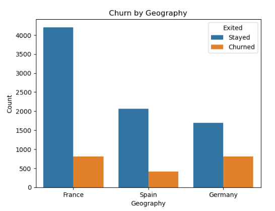
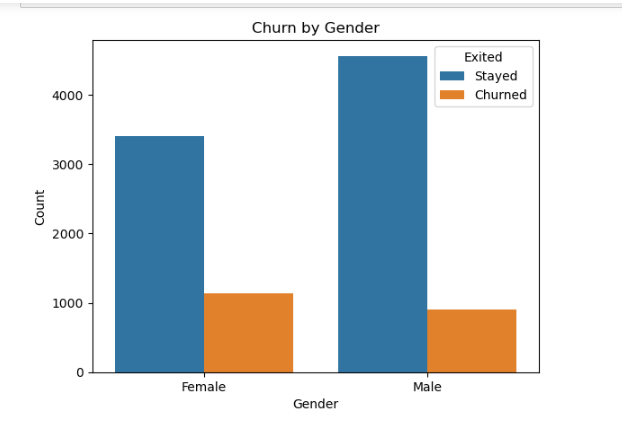
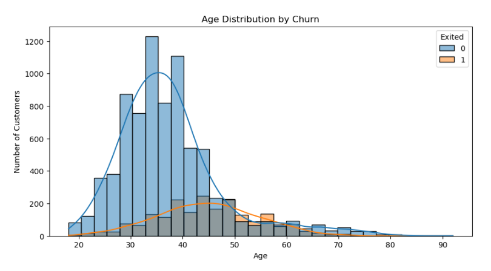
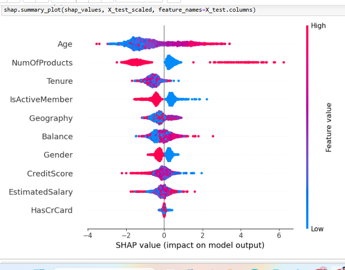

## Bank Churn Prediction (2025)

Predicting customer churn using machine learning to help banks retain high-value clients.  
This project uses structured data and advanced classification techniques with SHAP explainability.

## Project Objective

To build a predictive model that identifies which customers are likely to leave the bank.  
Understanding churn patterns can help implement proactive retention strategies.

## Dataset Overview

-  **Source**: [Kaggle – Churn-bank-customer dataset](https://www.kaggle.com/datasets/kartiksaini18/churn-bank-customer/data)
-  **Rows**: 10,000 customers
-  **Features**:
  - Demographics: `Gender`, `Age`, `Geography`, `Tenure`
  - Financial: `CreditScore`, `Balance`, `NumOfProducts`, `EstimatedSalary`
  - Status: `Exited` (target)

##  Technologies Used

- **Python** (Pandas, NumPy, Matplotlib, Seaborn)
- **Scikit-learn** (EDA, preprocessing, model building)
- **XGBoost & Random Forest**
- **SMOTE** for class imbalance
- **SHAP** for model interpretability
- **Jupyter Notebook**

## 🔍 Exploratory Data Analysis

 

Key findings:
- High churn in customers from **Germany**
- **Senior age group** shows higher churn
- Slightly more churn among **females**

## 🤖 Modeling and Performance

| Model          | Accuracy | Precision (Churn) | Recall (Churn) | F1 Score |
|----------------|----------|-------------------|----------------|----------|
| Logistic Regression | 80.5% | 0.59 | 0.14 | 0.23 |
| Random Forest       | 86.1% | 0.70 | 0.52 | 0.60 |
| XGBoost + SMOTE     | **84.5%** | 0.78 | 0.58 | **0.66** ✅ |

---

## 🧠 Model Explainability with SHAP

- `Age`, `NumOfProducts`, `Balance` had the most influence on predictions.
- SHAP helped visualize **feature impact at individual and global levels**.

---

## 📁 Project Structure

